# MIST4610Project1

## Team Name:
59925 Group 1

## Team Members:
1. Jacob Greenwald [@jg79522](https://github.com/jg79522)
2. Iliana Venegas [@imv2ven](https://github.com/imv2ven)
3. Alexa Persad [@aepersad](https://github.com/aepersad)
4. Allison Chaloupek [@allisonchaloupek](https://github.com/allisonchaloupek)
5. David Breen [@davidbreen23](https://github.com/davidbreen23)

## Problem Description:
The task at hand is to model and build a relational database for the general operations of a film production company network. The central entity in the model is the ProductionCompany entity, which represents each studio that finances, manages, and oversees film projects. Each production company works collaboratively with agents, actors, crew members, and distribution partners to bring movies from concept to release. The model captures the company’s relationships with agents and contracts, which govern talent representation and project negotiations. It also tracks movies, their filming locations, and production sites, as well as assignments connecting crew members and personnel to those sites. Beyond production, the model reflects the distribution side of operations, linking movies to theaters and corresponding revenue reports that provide insight into financial performance. We will accurately model these relationships, generate sample data, and populate the entities with representative information. We will also perform functioning queries on this data so they may yield valuable business insights into the film production process, such as tracking movie profitability, analyzing agent partnerships, and evaluating personnel and site utilization across projects.

## Data Model:
Our model represents the structure of a hypothetical film production network that captures how production companies, agents, personnel, and partners interact throughout the filmmaking process.

At the top level, the ProductionCompany entity represents different studios that oversee and finance film projects. Each production company works with multiple Agents to secure talent, negotiate agreements, and manage contracts. Similarly, each agent can work with several production companies at once. This many-to-many relationship between ProductionCompany and Agent is represented by the Contract entity, which serves as an associative entity containing details such as compensation, start dates, and end dates.

Each Agent manages multiple Persons, including actors, directors, and technical staff, establishing a one-to-many relationship between Agent and Person. Every Person can be assigned to various ProductionSites, and each ProductionSite can host multiple people working on different aspects of a film. This many-to-many relationship between Person and ProductionSite is represented by the Assignment entity, which serves as the associative table. The Assignment entity stores key details such as department, assignment ID, and start and end dates.

The Movie entity is central to the model. Each Movie can be filmed at several Locations, and each location can host multiple movies, creating a many-to-many relationship represented by the ProductionSite associative entity. The ProductionSite table includes information about the filming location name, the site permit, and the start and end dates.

Movies are also distributed through various TheaterCompanies. Because each movie can be shown by multiple theater companies, and each theater company can screen many movies, this many-to-many relationship is represented by the RevenueReport associative entity. The RevenueReport table captures financial details such as ticket sales and release dates.

Additionally, movies are linked to the Persons who contributed to them—such as actors, directors, and editors—through the Credits associative entity. This many-to-many relationship between Movie and Person records each individual’s credit type and character name if they have one.

Finally, since a single ProductionCompany can oversee the creation of multiple movies, there is a one-to-many relationship between ProductionCompany and Movie. This ties together the creative, operational, and financial aspects of filmmaking under one company, providing a comprehensive structure for managing the full production lifecycle within the data model.

## Data Dictionary:
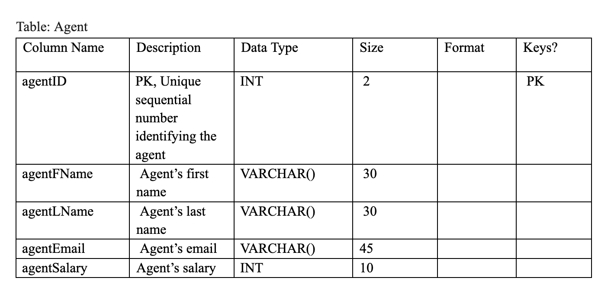

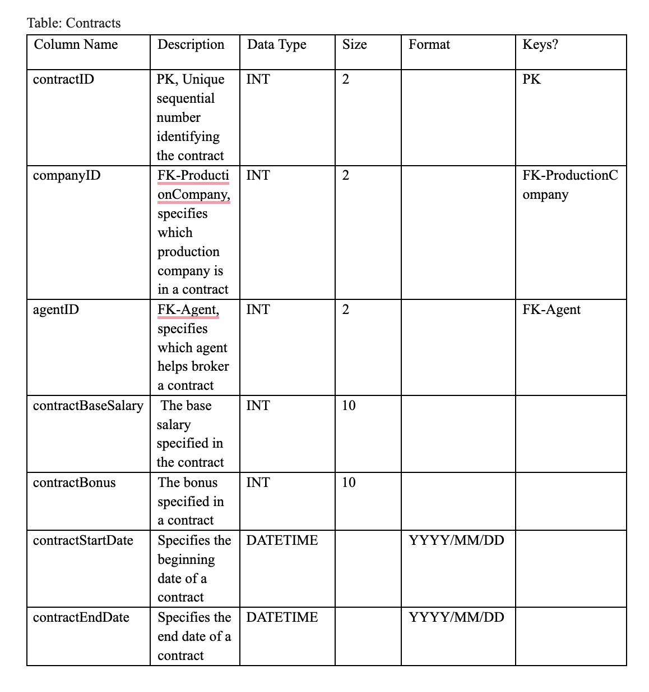

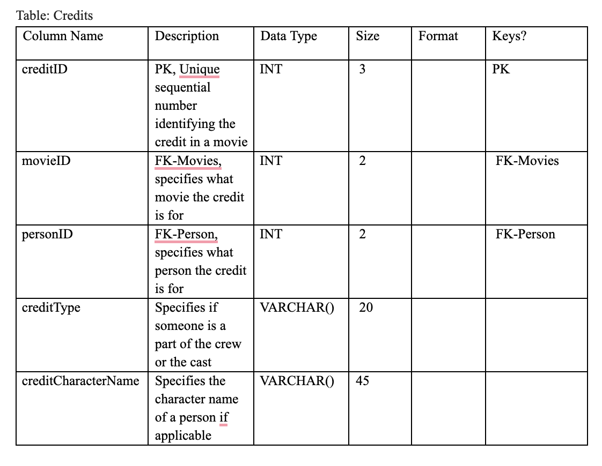

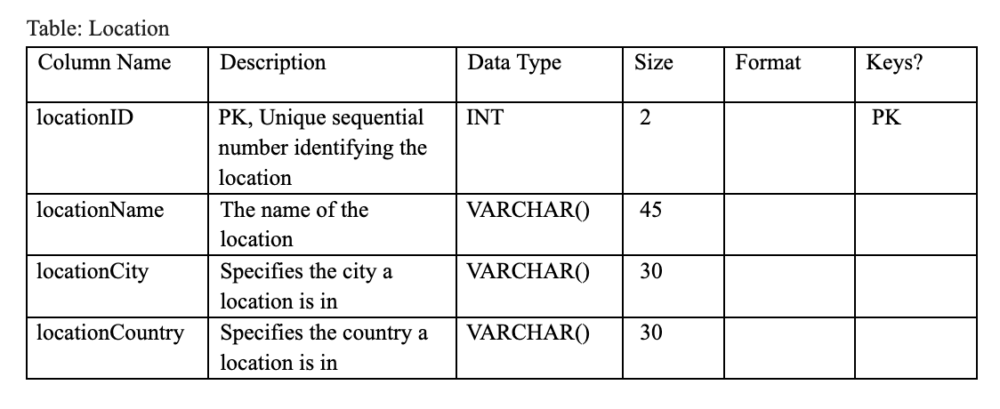

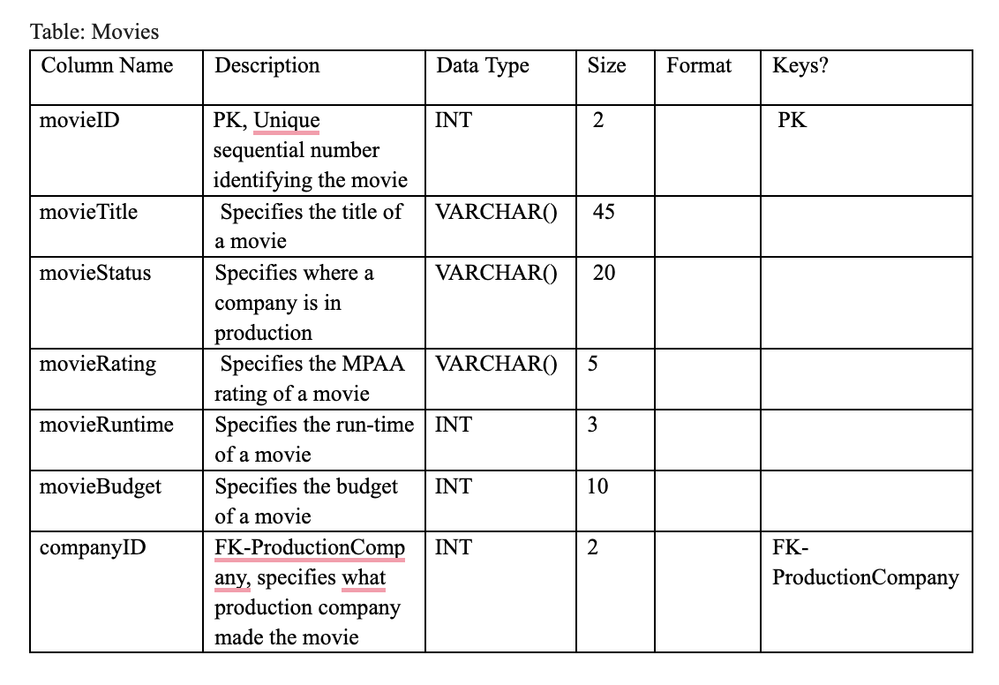

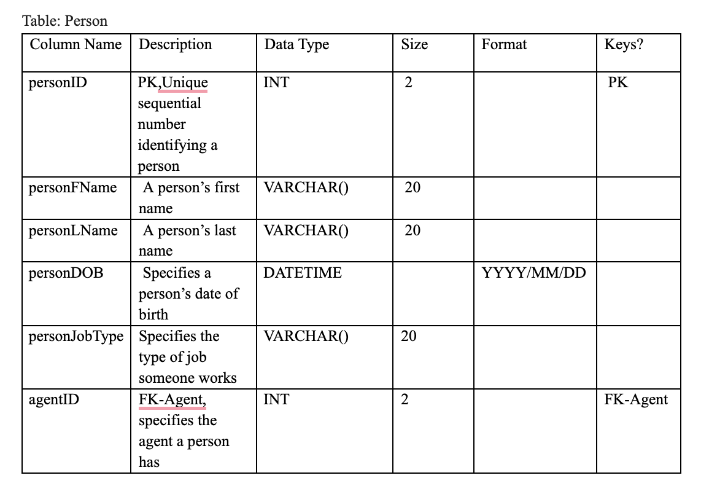

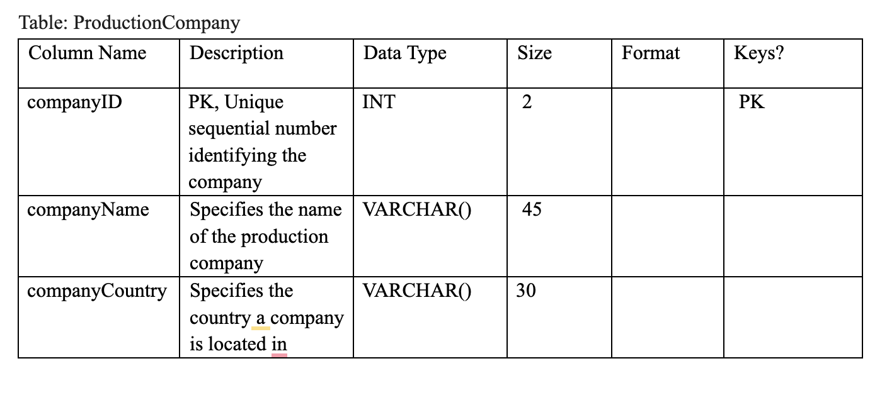

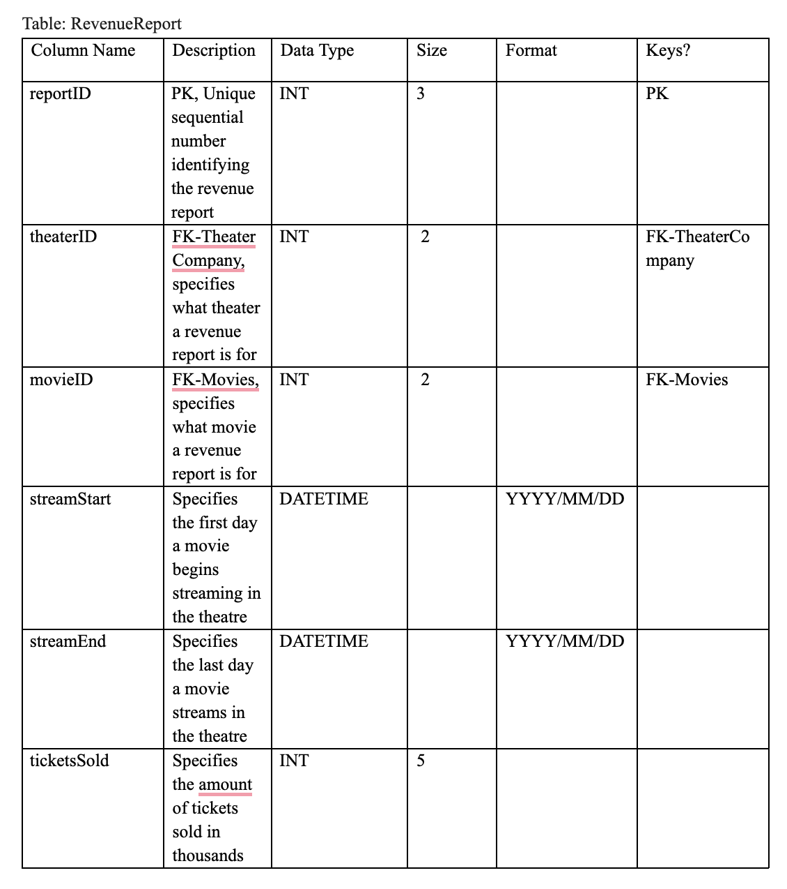

## Queries:

1. Query 1:
Query 1 lists the total ticket sales for movies that did not break even. It does this by comparing the ticket revenue (tickets sold (in thousands) x theater price) the budget for the film. By utilizing LEFT JOIN, the films with no recorded revenue will still be included in the results. Then, it filters the results of the sales of the movies to those that are less than or equal to their budget and orders them by descending total sales.

Query 1 allows managers to identify the films that resulted in losses. They can then makes investigate the causes of these losses and can make different decisions in regards to marketing, distribution, writing, or budgeting. This identification can guide the process and greenlighting of future projects.

2. Query 2:
Query 2 lists each agent’s name, salary, and number of actors they represent. It uses REGEXP to ensure that the output of the query only returns clients that are actors then sorts the agents alphabetically by last name.

Query 2 provides insight into the agents with the largest client bases which often correlates to the amount of influence and negotiation power they have in the industry. Knowing which agents have the most influence and power allows the production companies to determine which agents to cast through and what to expect in their contracts when budgeting.

3. Query 3:
Query 3 lists each actor’s name, the number of films they were in, and the average contract base salary negotiated by their agent (if available). The results are then filtered by film count to show those who have appeared in more films than others.

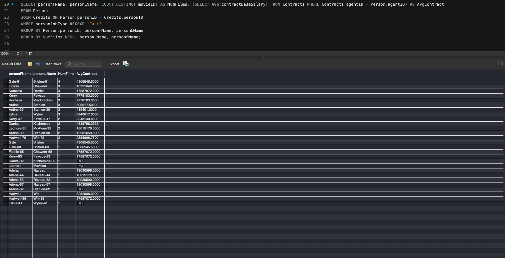

Query 3 assists managers in assessing an actor’s experience and the cost of hiring them. More experience actors would cost more to contract on a film but would most likely yield higher audiences. This information is helpful for making casting decisions while factoring in budgets and movie performance.

4. Query 4:
Query 4 calculates the average number of tickets sold for movies, their rating, and their average runtime. It uses a subquery to calculate the total ticket sales per movie before averaging them across movie rating. Then, it orders the results by average ticket volume.

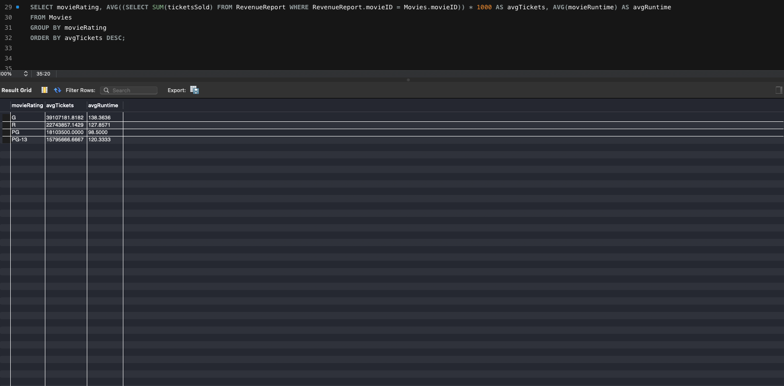

Query 4 analyzes the different performances of different movie ratings and allows managers to make informed decisions about which films to endorse. Certain ratings and runtimes may outperform others so studios may allocate more resources towards producing and greenlighting those profitable movies.

5. Query 5:
Query 5 counts the number of productions that began at each set location during the first half of the year by filtering the start dates of production sites to the ones that occur between January and June.

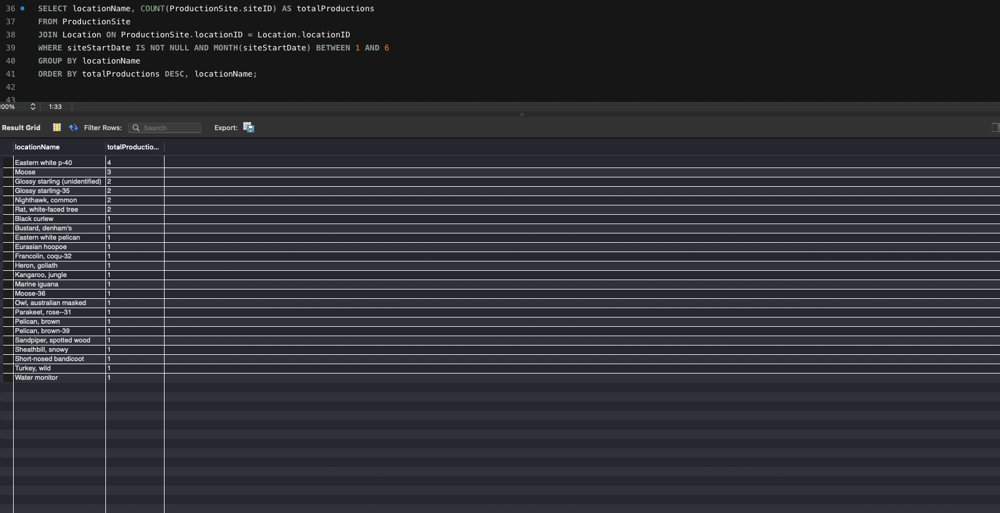

Query 5 identifies which locations are the most popular during the busiest time for movie production. This information would assist managers in allocating resources, staff, capacity and contracts.

6. Query 6:
Query 6 lists each member of the crew, the number of movies they’ve worked on, and the total number of assignments they’d been responsible for. It filters the results using REGEXP to include only members of the crew without the cast members. It orders by the number of assignments to highlight the most active crew member.

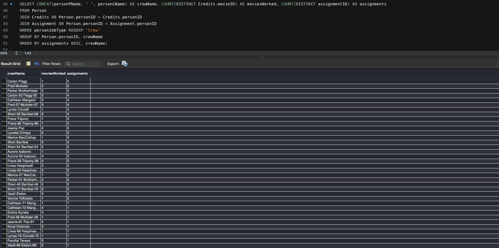

Query 6 allows managers to identify the top-performing crew members who have the most experience. This information assists managers with staffing allocations, promotions, and future team planning.

7. Query 7:
Query 7 identifies the movies that have a higher budget than the average budget of films with the same maturity rating. It uses a correlated subquery to compare budgets and the query orders the films by ticket sales to display the most popular sales with their specific budget and rating.

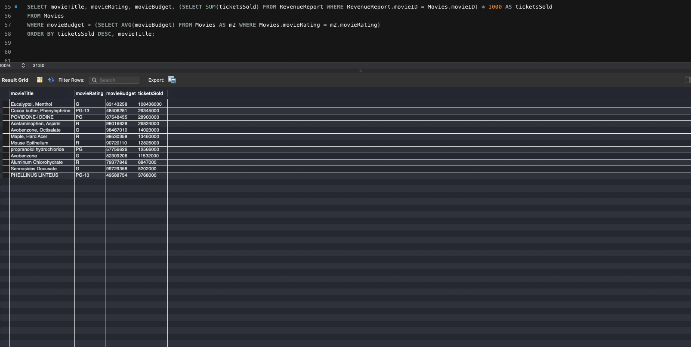

Query 7 allows managers to see if higher budgets in specific ratings correlate to higher or lower ticket sales. This information would assist in budgeting, production involvement risk, and greenlighting decisions.

8. Query 8:
Query 8 ranks theaters based on the total revenue generated by ticket sales. It multiplies ticket volume (in thousands) by the price offered by the particular theater to determine the revenue and then orders the theaters according to the highest to lowest revenue.

Query 8 shows the highest performing theaters which would allow managers to make decisions on where to distribute their films to aim for the highest profit. They can use these results to optimize marketing efforts, locations for exclusive events, and distribution strategies.

9. Query 9:
Query 9 calculates the average number of days required to complete productions at each set location. It takes the difference between start and end dates to determine the time frame and then orders the locations by the shortest time frames to the largest.

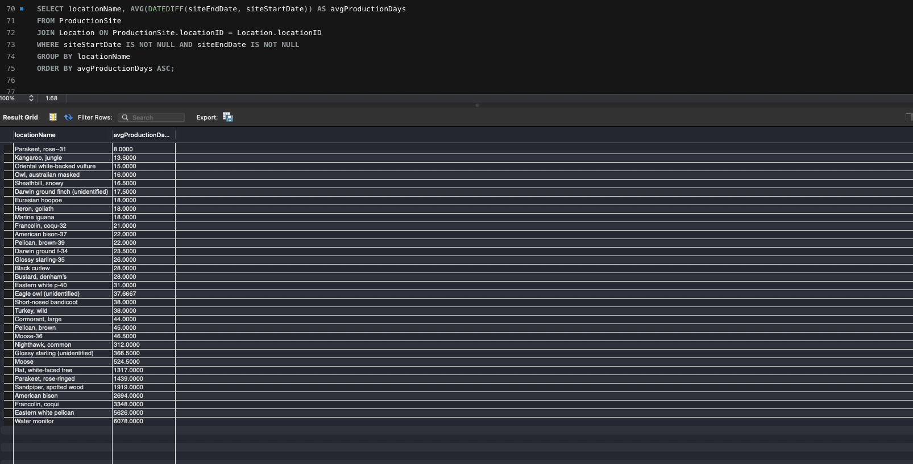

Query 9 provides managers with the efficiency of each location. They can use these metrics to create strategies for which locations to schedule productions more frequently, which location to pick for a particular film’s timeline, and overall budgeting for production timing.

10. Query 10:
Query 10 identifies movies that have no revenue reports by checking the existence of the report for each film.

Query 10 flags the potential missing data associated with films or the films who have generated 0 sales. Managers use this to check for errors within the revenue reporting department or address possible issues to prevent a null value within their records.

## Database Information:
Name of the database: ns_F25MIST4610_59925_Group1

Additional information: Each query listed above is marked in the database using stored
